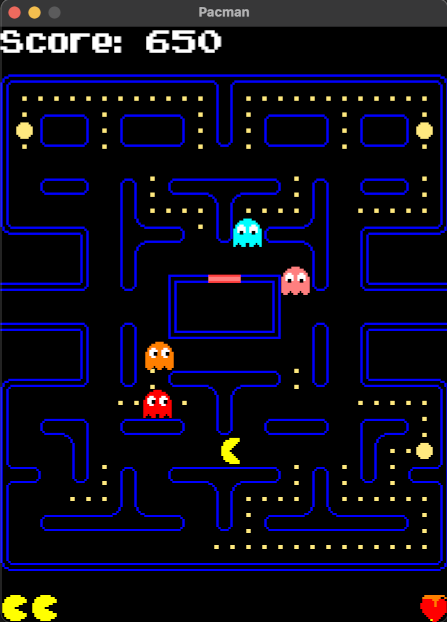

#LÖVE PacMan
Pac-Man, originally called Puck Man in Japan, is a 1980 maze action video game developed and released by Namco for arcades. Game from repo is created in Love2D.

## Screenshots

## Addons
* [Love2D](https://love2d.org) - website of LÖVE.
* [Biopushy module](https://github.com/a327ex/boipushy) - github page
* [anim8 module](https://github.com/kikito/anim8) - github page
* [hump module](https://github.com/vrld/hump) - github page
* [sti module](https://github.com/karai17/Simple-Tiled-Implementation) - github page
* [Font](https://www.dafont.com/) - font
* [Pacman Qt-Cpp](https://github.com/Przemekkkth/Pacman_Qt-Cpp) - other Pacman project wiritten in Qt/C++
* [yt](https://youtu.be/sUWMuXYwTCc) - gameplay
